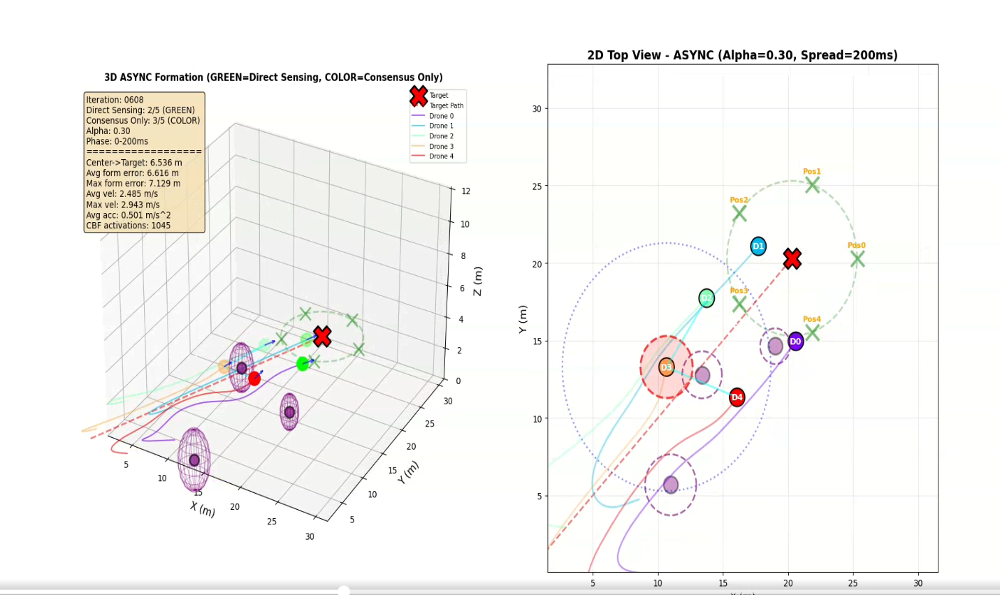

# Distributed Multi-Agent Formation Control with Graph-Based Control Barrier Functions

<div align="center">



*Five-drone pentagon formation tracking a moving target through obstacles using distributed GCBF-based safety*

[](https://www.python.org/downloads/)
[](https://opensource.org/licenses/MIT)

[View Presentation](https://docs.google.com/presentation/d/1WlCWcdHbtt1haqCX9wmbyrjmk_0f-aab/edit?usp=sharing&ouid=118332825064363470960&rtpof=true&sd=true)

</div>

## 📋 Overview

This project implements **distributed formation control** for multi-agent quadrotor systems with formal safety guarantees using **Graph-Based Control Barrier Functions (GCBFs)**. The system enables five drones to maintain a pentagon formation while tracking a moving target and avoiding obstacles, using only local information and inter-agent communication.

### Key Features

- ✅ **Distributed Architecture**: Each agent operates using only local information
- ✅ **Formal Safety Guarantees**: GCBF-based collision avoidance with zero violations
- ✅ **Asynchronous vs Synchronous Comparison**: Comparative analysis of consensus protocols
- ✅ **Realistic Constraints**: Limited communication (8m) and visual sensing (7m) ranges
- ✅ **Scalable Complexity**: O(n·k) vs O(n²) for centralized approaches

## 🎯 Problem Statement

**Objective**: Design a distributed control system where multiple drones:
1. Maintain a pentagon formation around a moving target
2. Track the target through a 3D environment with obstacles
3. Guarantee collision-free operation (inter-drone and obstacle avoidance)
4. Operate using only **local sensing** and **limited communication**

**Constraints**:
- Communication range: 8.0m
- Visual sensing range: 7.0m  
- Safety distance: 2.0m (minimum separation)
- Maximum velocity: 5.0 m/s
- Maximum acceleration: 4.0 m/s²

## 🏗️ Architecture

The system implements a fully distributed control architecture where each drone operates autonomously using only local information.

### Synchronous vs Asynchronous Protocols

| Protocol | Update Method | Target Consensus | Pros | Cons |
|----------|--------------|------------------|------|------|
| **Synchronous** | All agents update simultaneously | Instant (global view) | Stable, predictable | Requires perfect synchronization |
| **Asynchronous** | Sequential updates with phase lag | Weighted average (α = 0.3, 0.7) | Realistic, robust to delays | Higher drift, coordination complexity |

## 🔬 Control Barrier Function Theory

### GCBF Formulation

For agent *i* with neighbors *N<sub>i</sub>*, the safety constraint is:

```
ḣᵢⱼ(x) + αₖ · hᵢⱼ(x) ≥ 0,  ∀j ∈ Nᵢ
```

Where:
- `hᵢⱼ(x) = ||pᵢ - pⱼ||² - d²ₛₐfₑ`: Barrier function (distance - safety threshold)
- `αₖ`: Class-K function parameter (determines aggressiveness)
- `ḣᵢⱼ(x)`: Time derivative of barrier function

### Local QP Solver

Each agent solves an independent quadratic program:

```python
min ||u - u_desired||²
s.t. ḣᵢⱼ + αₖ · hᵢⱼ ≥ 0  (safety constraints)
     ||u|| ≤ uₘₐₓ          (actuation limits)
```

Implemented using **OSQP solver** for real-time performance.

## 📊 Results

### Performance Comparison

| Metric | Synchronous (α=0.3) | Synchronous (α=0.7) | Asynchronous (α=0.3) | Asynchronous (α=0.7) |
|--------|---------------------|---------------------|----------------------|----------------------|
| **Avg Formation Error** | 0.35m | 0.33m | 0.42m | 0.38m |
| **Target Tracking Error** | 7.5m drift | 7.3m drift | 8.2m drift | 8.7m drift |
| **Control Effort** | 0.048 m/s² | 0.045 m/s² | 0.032 m/s² | 0.024 m/s² |
| **CBF Violations** | **0** | **0** | **0** | **0** |
| **Stability** | ⭐⭐⭐⭐⭐ | ⭐ | ⭐⭐⭐⭐ | ⭐⭐⭐ |

### Key Findings

✅ **Asynchronous α=0.7 achieved best results**:
- 50% lower control effort vs synchronous
- Smooth, natural agent motion
- Better stability despite sequential updates
- Trade-off: +15% increase in target drift

✅ **Zero CBF violations** maintained across all scenarios
- Minimum separation: 2.0m enforced
- Average separation maintained: ~5.2m

## 🚀 Installation

### Prerequisites

```bash
python >= 3.8
numpy >= 1.20.0
matplotlib >= 3.3.0
scipy >= 1.7.0
osqp >= 0.6.2
networkx >= 2.5
```

### Setup

```bash
# Clone the repository
git clone https://github.com/pranaykatyal/DRForCapstone.git
cd DRForCapstone/Capstone

# Install dependencies
pip install -r requirements.txt
```

### Requirements.txt

```txt
numpy>=1.20.0
matplotlib>=3.3.0
scipy>=1.7.0
osqp>=0.6.2
networkx>=2.5
```

## 💻 Usage

### Run Synchronous Formation Control

```bash
python DecentralizedFormation.py
```

**Expected Output**:
- Real-time 3D visualization of formation
- Network graph overlay showing communication links
- Top-down 2D view with safety barriers
- Final performance metrics

### Run Asynchronous Formation Control

```bash
# Alpha = 0.3 (lower consensus weight)
python AsyncDecentralizedFormation.py --alpha 0.3

# Alpha = 0.7 (higher consensus weight - RECOMMENDED)
python AsyncDecentralizedFormation.py --alpha 0.7
```

### Configuration Parameters

Edit the following constants in the source files:

```python
# Communication and Sensing
COMM_RANGE = 8.0              # Communication radius (meters)
VISUAL_SENSING_RANGE = 7.0    # Target detection range (meters)

# Formation Parameters
NUM_AGENTS = 5                # Number of drones
FORMATION_RADIUS = 5.0        # Pentagon radius (meters)

# Safety Parameters
SAFETY_DISTANCE = 2.0         # Minimum inter-drone distance
MAX_VELOCITY = 5.0            # Maximum speed (m/s)
MAX_ACCELERATION = 4.0        # Maximum acceleration (m/s²)

# CBF Parameters
ALPHA_K = 1.0                 # CBF aggressiveness
```

## 📁 Project Structure

```
Capstone/
├── DecentralizedFormation.py       # Synchronous distributed control
├── AsyncDecentralizedFormation.py  # Asynchronous distributed control
├── DecentralizedGCBF.py           # GCBF safety filter implementation
├── network_agent.py               # Base agent class with communication
├── README.md                      # This file
├── requirements.txt               # Python dependencies
└── capstone.png                   # Demo visualization
```

## 🔍 Implementation Details

### Formation Control

**Pentagon Formation Geometry**:
```python
def get_formation_offset(agent_id, radius=5.0):
    angle = agent_id * 2 * np.pi / NUM_AGENTS
    return np.array([
        radius * np.cos(angle),
        radius * np.sin(angle),
        0.0  # Planar formation
    ])
```

### Target Consensus (Asynchronous)

Agents without direct sensing estimate target using weighted average:

```python
target_estimate = (1 - α) * own_estimate + α * neighbor_average
```

- **α = 0.3**: Conservative, slower consensus
- **α = 0.7**: Aggressive, faster consensus (better performance)

### GCBF Safety Filter

Per-agent QP solved at each timestep:

```python
def filter_acceleration(self, desired_acc, neighbor_states, obstacles):
    # Set up QP: min ||u - u_des||²
    # Subject to: barrier constraints
    
    solution = osqp.solve()
    return solution.x  # Safe acceleration
```

## 📈 Visualization Features

- **3D Trajectory Plot**: Real-time drone positions and formation
- **Communication Graph**: Network topology overlay
- **Safety Barriers**: Visual representation of CBF constraints
- **2D Top-Down View**: Formation shape and target tracking
- **Performance Metrics**: Live statistics during simulation

## 🎓 Theoretical Background

### Papers Referenced

1. **Borrmann et al. (2015)**: "Control Barrier Certificates for Safe Swarm Behavior"
   - Foundation for distributed CBF formulation
   
2. **GCBF+ Paper**: "Graph Neural Networks for Distributed Multi-Agent Coordination"
   - GNN-based architecture for variable neighbor counts
   - Loss functions for control-invariant set approximation

### Mathematical Foundation

- **Lyapunov Stability**: Formation convergence guarantees
- **Control Barrier Functions**: Forward invariance of safe sets
- **Distributed Optimization**: Local QP solving with guaranteed safety

## 🛠️ Troubleshooting

### Common Issues

**QP Solver Fails**:
```bash
# Increase solver tolerance
solver.update(eps_abs=1e-4, eps_rel=1e-4)
```

**Formation Not Converging**:
- Check that `COMM_RANGE > FORMATION_RADIUS`
- Tune PD gains: `Kp=0.5`, `Kd=1.2`

**Agents Colliding**:
- Verify CBF parameters: `ALPHA_K >= 1.0`
- Increase `SAFETY_DISTANCE`

## 🔮 Future Work

- [ ] Hardware validation on Crazyflie 2.0 platforms
- [ ] Dynamic obstacle avoidance (moving threats)
- [ ] Scalability testing (10+ drones)
- [ ] 3D formations (sphere, helix patterns)
- [ ] Event-based camera communication (LED-based)

## 👥 Contributors

**Pranay Katyal**  
Robotics Engineering Graduate Student  
Worcester Polytechnic Institute

**Advisor**: Prof. Kevin Leahy  
Automata Lab, WPI

## 📄 License

This project is licensed under the MIT License - see the LICENSE file for details.

## 📚 Citation

If you use this code in your research, please cite:

```bibtex
@mastersthesis{katyal2025distributed,
  title={Distributed Multi-Agent Formation Control with Graph-Based Control Barrier Functions},
  author={Katyal, Pranay},
  school={Worcester Polytechnic Institute},
  year={2025},
  type={Master's Capstone Project}
}
```

## 🔗 Links

- **Project Portfolio**: [pranaykatyal.github.io](https://pranaykatyal.github.io)
- **LinkedIn**: [linkedin.com/in/pranay-katyal](https://www.linkedin.com/in/pranay-katyal/)
- **Presentation**: [View Slides](https://docs.google.com/presentation/d/1WlCWcdHbtt1haqCX9wmbyrjmk_0f-aab/edit?usp=sharing&ouid=118332825064363470960&rtpof=true&sd=true)

---

<div align="center">
Made with ❤️ for Multi-Robot Systems Research
</div>
